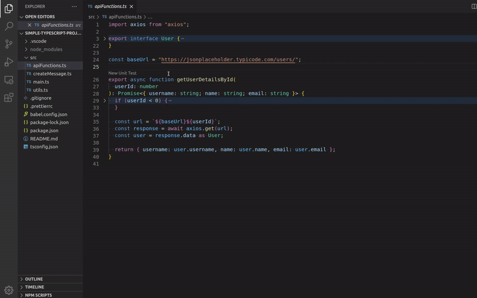

# Testent VSCode extension

Testent is an IDE extension which helps you to write unit tests for Typescript code. The tests are made for Jest testing framework. Your code does not leave your computer in the process.

**Note**
This extension is in it's early stage so please expect some bumps and bugs on your way using it.

If you find bugs and code syntax which does not work I would ask you to please send feedback. You can for example create an Github Issue [here](https://github.com/testent-io/vscode-extension/issues) or email me to [juha@testent.io](juha@testent.io)

<br/><br/>

## Generating unit tests

Testent writes unit tests for functions from inputs you give. The function you want to test is executed in your environment with the given inputs. This means that the environment used by the function needs to be reachable.

<p align="center">
  <picture>
      <source srcset="https://github.com/testent-io/vscode-extension/raw/HEAD/images/docs/testent-automated-unit-test-writing-preview.webp" type="image/webp">
      <source srcset="https://github.com/testent-io/vscode-extension/raw/HEAD/images/docs/testent-automated-unit-test-writing-preview.gif" type="image/gif">
      
  </picture>
</p>

- The `createInternalFunctionExpects_X` option let's you choose if the internal logics of the function you test should be tested. If enabled `expect`-statements will be created for internal logics

<br/><br/>

## Running a function with inputs

Testent can also execute your function with the given inputs for you to test what the function returns or throws.

<p align="center">
  
</p>

<br/><br/>

## Current limitations

As said this extension is in it's early stage and not everything will work. Here is a list of some syntax which will not work at the moment.

If you find more syntax which does not work, please let me know. You can create an Github Issue [here](https://github.com/testent-io/vscode-extension/issues) or email me to [juha@testent.io](juha@testent.io)

<br/>

- You cannot edit existing tests at the moment with the Testent extension.

  - You can only create new tests with the Testent extension at the moment
  - You can ofcourse edit the generated test manually as you like. They are just pure Jest tests.
  - An existing test with the same name will be overriden with the new test generated

- Function overloads might break the Typescript typing of the created test file

  ```typescript
  // Generated mock which might fail to pick the right overload and give Typescript error
  const mockedMyFunc = jest.mocked(myFunc, false);

  // You have to add the right typing of function to the mock. In this example <(myArg: string) => boolean>
  const mockedMyFunc = jest.mocked<(myArg: string) => boolean>(myFunc, false);
  ```

- Not explicitly speficying the returned type

  ```typescript
  // Not supported because return type is not explicitly given
  export function myFunc(myArg: string) //<-- Error, no return type explicitly given
  {
  	...
  }

  // You have to add the return type
  export function myFunc(myArg: string): number {
  	...
  }
  ```

- Functions returning a function

  ```typescript
  // Not supported
  const iReturnAFunction = (myArg: any): (() => boolean) => {
  	return () => true; //<-- Error, returning function
  };

  // Not supported
  function iTooReturnAFunction(myArg: string): (myInnerArg: string) => string {
  	return function (myArg) {
  		//<-- Error, returning function
  		return 'Hello ' + myArg;
  	};
  }
  ```

- Anything else than a function call inside an Await

  ```typescript
  // Not supported
  async function myFunc() {
  	const y = await 20; //<-- Error, not a function inside await
  }

  // Not supported
  const thenable = {
  	then: function (resolve, _reject) {
  		resolve('resolved!');
  	},
  };
  const myVar = await thenable; //<-- Error, not a function inside await
  ```

- Accessing a property of a call expression result without assigning the call exprssion result first

  ```typescript
  // Not supported
  const myVar = myFunc().myProp; //<-- Error
  ```

- Recursive function calls are not supported

  ```typescript
  // Not supported
  const myFunc = (myVar) => {
    ...
    const result = myFunc(someValue); // <--- Error
    ...
  };
  ```

- Following object chains and re-assignments

  ```typescript
  // Not supported
  const result = myfunc(myInputArg);
  const myVar = result.one.two; // <--- Error
  return myVar.three; // <--- Error
  ```

- Destructed catch clause error

  ```typescript
  // Not supported
  try {
    ...
  } catch({ message }) { // <--- Error, destructing an object
    ...
  }
  ```

- require function used to import dependencies

  ```typescript
  // Not supported
  const myFunc = require('./myFunc');  // <-- Error, using require
  ...
  ```

- Object which has methods as function input

  ```typescript
  export interface MyObj {
    name: string;
    phone: number;
    doStuff: (myArg: string) => string; // <-- Error, object with an method used as input
  }

  // Not supported
  export function myFunc(
    obj: MyObj // <-- Error, object with an method used as input
    ): boolean {
    ...
  }
  ```

- Environmental variables

  ```typescript
  // Not supported
  export function myFunc(myArg: string): boolean {
    const result = doStuff(
      process.env.MY_SECRET, // <-- The value of the environmental variable will be saved to the unit test written. You can then change the value to what ever you want.
      myArg);
    ...
  }
  ```

  - Environmental variable values referenced in the function tested are written to the test file generated at the moment. You can manually replace the value in the generated file after the test has been generated. Later on the real values of environmental variables are masked away.

- Non-exported functions

  ```typescript
  // Not supported
  function iamNotExported(): string { //<-- Error, Function is not exported
    ...
  };
  ```

- Classes and methods in them
  ```typescript
  // Not supported
  export class MyClass {
  	myMethod(myArg: number): number {
  		//<-- Error, Class method.
  		return myArg * 100;
  	}
  }
  ```

<br/><br/>

## Settings

You can change some settings by editing `settings.json`-file in `.vscode`-folder or from menu `File->Preferences->Settings->Extensions->Testent`

### General

- `testent.general.sourceFolder`
  - Specifies folder where source files are with relation to project root folder. If source is at root folder set empty string as value
  - Default `src`

### Logging

- `testent.logging.outputLevel`
  - Specifies how much (if any) output will be sent to the GitLens output channel
  - Options: `silent`, `errors`, `verbose`, `debug`
  - Default `errors`

### Testent Code Lens

- `testent.codeLens.enabled`
  - Specifies whether to provide any code lens.
  - Default `true`

### Terminal Options

- `testent.terminalOptions.windowsTerminalType`

  - Specify the Windows terminal to use
  - Options: `powerShell`, `bashKind`, `cmd`
  - Default `powerShell`

- `testent.terminalOptions.windowsTerminalExecutablePath`

  - Specify absolutepath to the terminal executable
  - Default `C:\\Windows\\System32\\WindowsPowerShell\\v1.0\\powershell.exe`

- `testent.terminalOptions.linuxTerminalType`

  - Specify terminal to use in Linux
  - Options: `bash`, `sh`,
  - Default `bash`

- `testent.terminalOptions.linuxTerminalExecutablePath`

  - Specify absolutepath to the terminal executable or empty string if your default shell is supported
  - Default `""`

- `testent.terminalOptions.macTerminalType`

  - Specify terminal to use in Mac
  - Options: `zsh`, `bash`,
  - Default `zsh`

- `testent.terminalOptions.macTerminalExecutablePath`
  - Specify absolutepath to the terminal executable or empty string if your default shell is supported
  - Default `""`

### Javascript Run Options

- `testent.javascriptRunOptions.commonPreExecutable`

  - Specifies things to add to the terminal execution command before the `testent.runOptions.executable`
  - Default `""`

- `testent.javascriptRunOptions.envVarsWhenESModule`

  - Specifies environmental variables for when running ES module. Available variables are `sourceFileDirAbsPath`, `tsConfigJsonFileAbsPath`, `tsNodeInstallationPath`. Surround vars with `{{` and `}}`
  - Default
    ```json
    {
    	"NODE_OPTIONS": "--no-warnings --experimental-specifier-resolution=node --input-type module"
    }
    ```

- `testent.javascriptRunOptions.envVarsWhenCommonJS`

  - Specifies environmental variables for when running CommonJS module. Available variables are `sourceFileDirAbsPath` and `tsConfigJsonFileAbsPath`, `tsNodeInstallationPath`. Surround vars with `{{` and `}}`
  - Default

  ```json
  {
  	"NODE_OPTIONS": "--no-warnings --experimental-specifier-resolution=node"
  }
  ```

- `testent.javascriptRunOptions.socketPort`
  - Specifies port for socket communication between extension and user's instrumented code running in an child process.
  - Default `7123`

### Typescript Run Options

- `testent.typescriptRunOptions.commonPreExecutable`

  - Specifies things to add to the terminal execution command before the `testent.runOptions.executable`
  - Default `""`

- `testent.typescriptRunOptions.envVarsWhenESModule`

  - Specifies environmental variables for when running ES module. Available variables are `sourceFileDirAbsPath`, `tsConfigJsonFileAbsPath`, `tsNodeInstallationPath`. Surround vars with `{{` and `}}`
  - Default
    ```json
    {
    	"NODE_OPTIONS": "--no-warnings --experimental-specifier-resolution=node --loader {{tsNodeInstallationPath}}/ts-node/esm/transpile-only.mjs --input-type module",
    	"TS_NODE_TRANSPILE_ONLY": "true",
    	"TS_NODE_PROJECT": "{{tsConfigJsonFileAbsPath}}",
    	"TS_NODE_CWD": "{{sourceFileDirAbsPath}}"
    }
    ```

- `testent.typescriptRunOptions.envVarsWhenCommonJS`

  - Specifies environmental variables for when running CommonJS module. Available variables are `sourceFileDirAbsPath` and `tsConfigJsonFileAbsPath`, `tsNodeInstallationPath`. Surround vars with `{{` and `}}`
  - Default

  ```json
  {
  	"NODE_OPTIONS": "--no-warnings --experimental-specifier-resolution=node -r {{tsNodeInstallationPath}}/ts-node/register/index.js",
  	"TS_NODE_TRANSPILE_ONLY": "true",
  	"TS_NODE_PROJECT": "{{tsConfigJsonFileAbsPath}}",
  	"TS_NODE_CWD": "{{sourceFileDirAbsPath}}"
  }
  ```

- `testent.typescriptRunOptions.tsconfigRelPath`

  - Specify relative path to tsconfig-file in relation to project's root path and the name of the file
  - Default `./tsconfig.json`

- `testent.typescriptRunOptions.socketPort`
  - Specifies port for socket communication between extension and user's instrumented code running in an child process.
  - Default `7123`

## Telemetry

By default, telemetry data collection is turned on to understand user behavior to improve this extension. To disable it, update the settings.json as below:

```json
{
	"testent.telemetry.enabled": false
}
```

This extension also respects the VSCode's global `telemetry.enableTelemetry` setting
